先来一个看不懂的官方文档
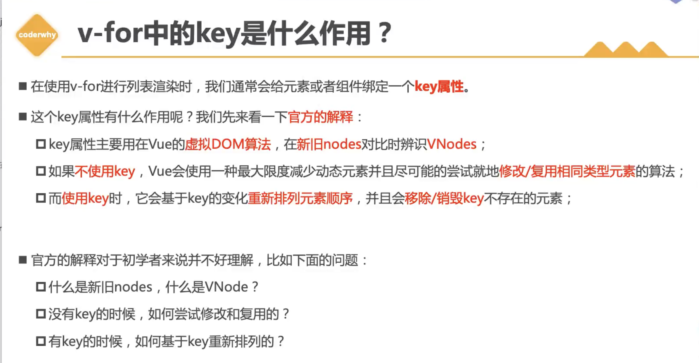
什么是VNode？
首先VNode是一个虚拟节点，我们在vue中声明的所有组件和元素都会变成VNode
其次VNode是一个JavaScript对象，它描述了组件的属性和结构
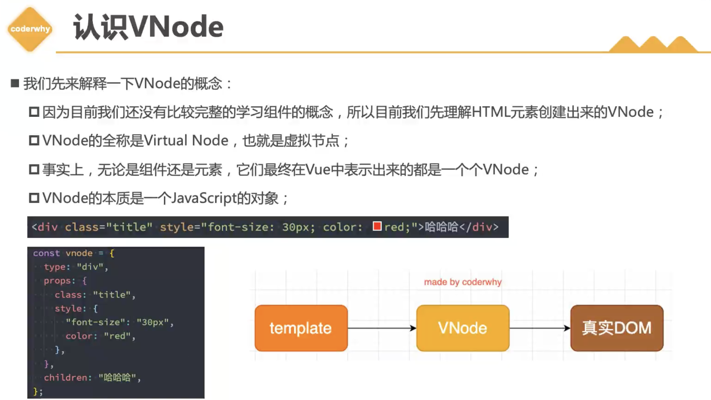
虚拟DOM其实叫虚拟DOM树 不渲染成真实DOM是为了做跨平台
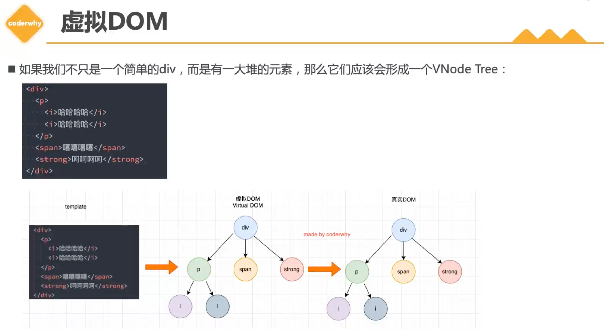
在04代码的案例中，vue内部会有一些优化，比如diff算法，会根据新旧VNode进行比较，只更新需要更新的部分
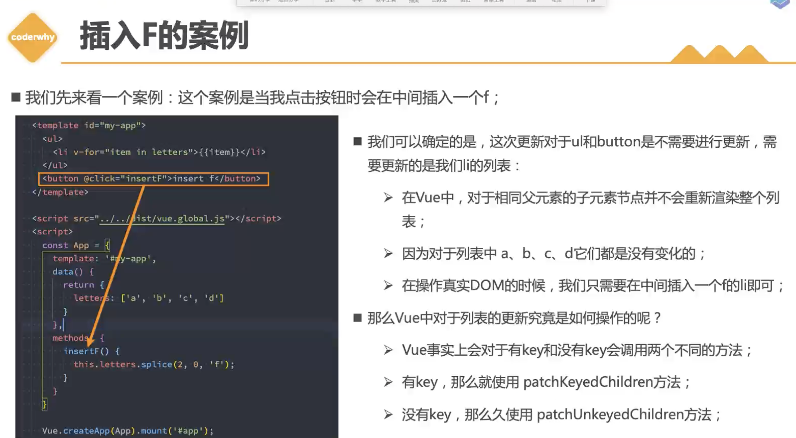
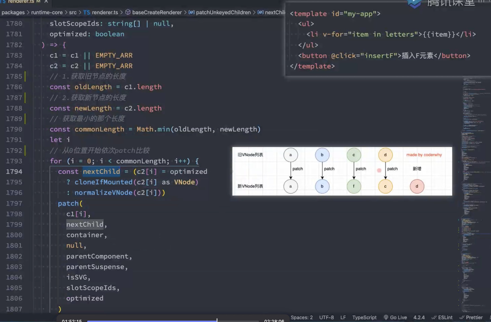
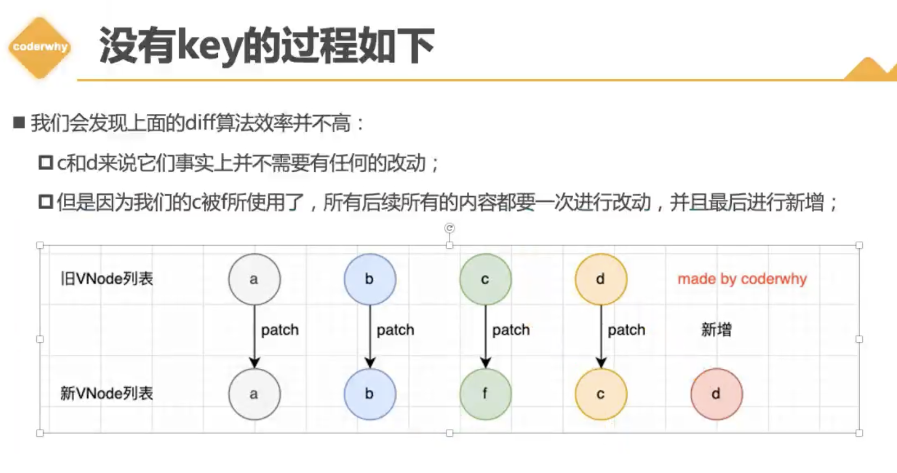
没有key的时候的做饭如上，我们期望的是做一个插入和挪动的操作
带有key的时候diff算法如下：
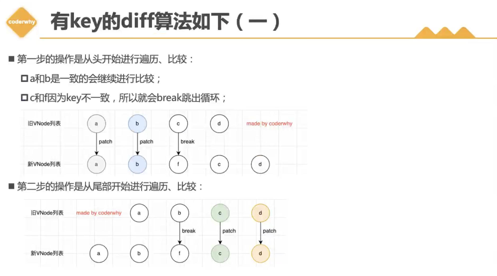
先从头部patch，然后从尾部patch patch->如果有n1，进行更新操作，如果n1为null，进行mount操作：
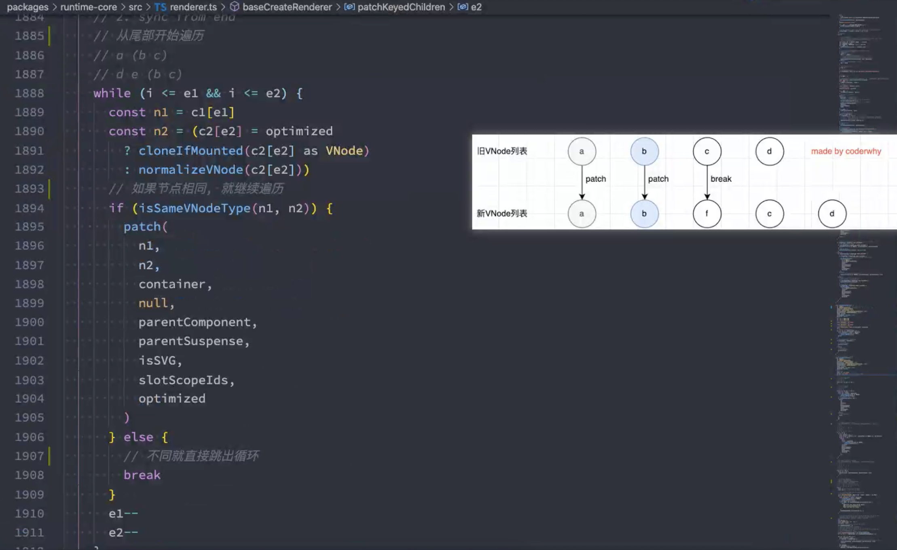
key不一样 break：
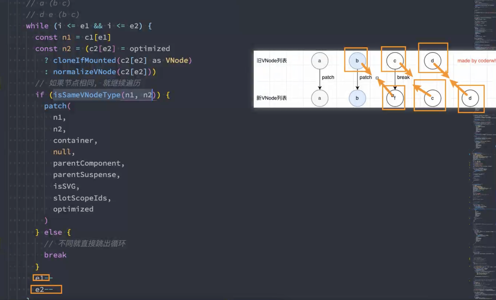
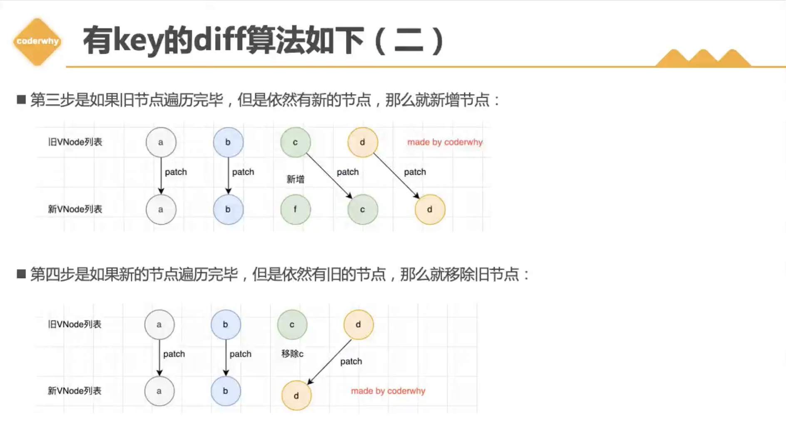
第三步中，源码里面新增节点是这个位置为null的时候就进行挂载 mount挂载： div->放到真实DOM 就是挂载
unmount卸载： 真实DOM->div 就是卸载
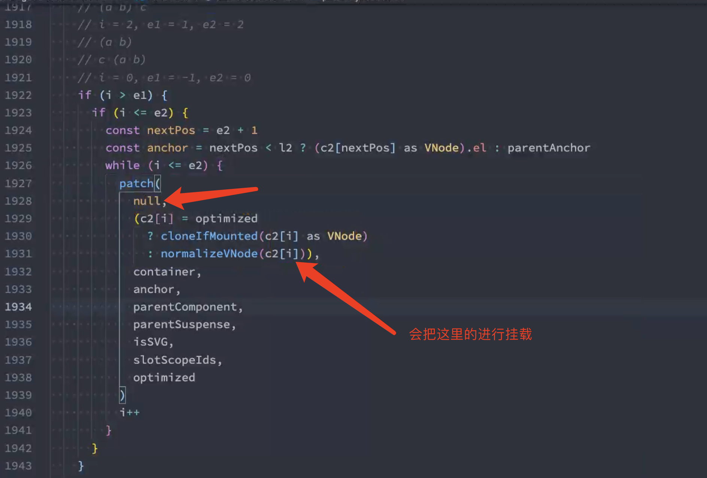
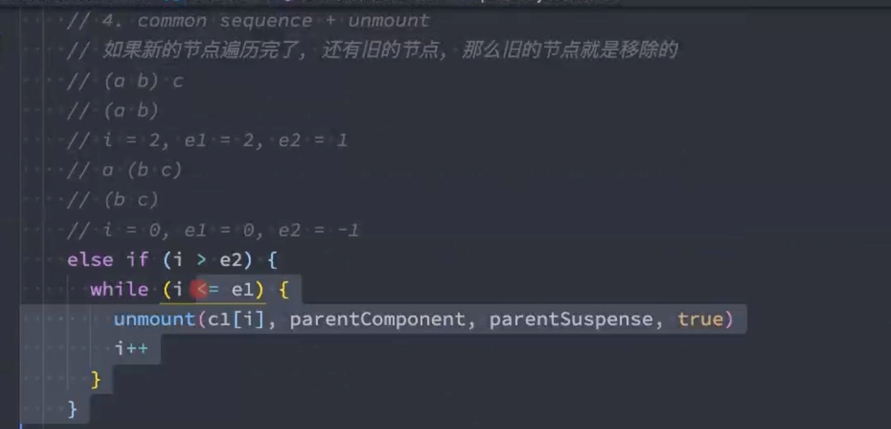
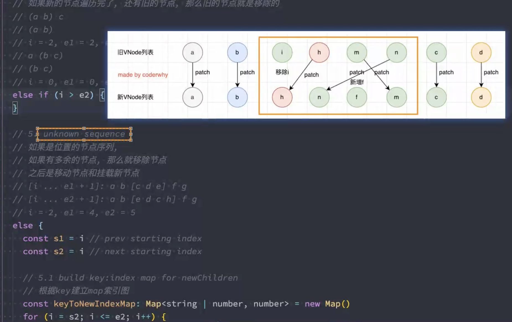
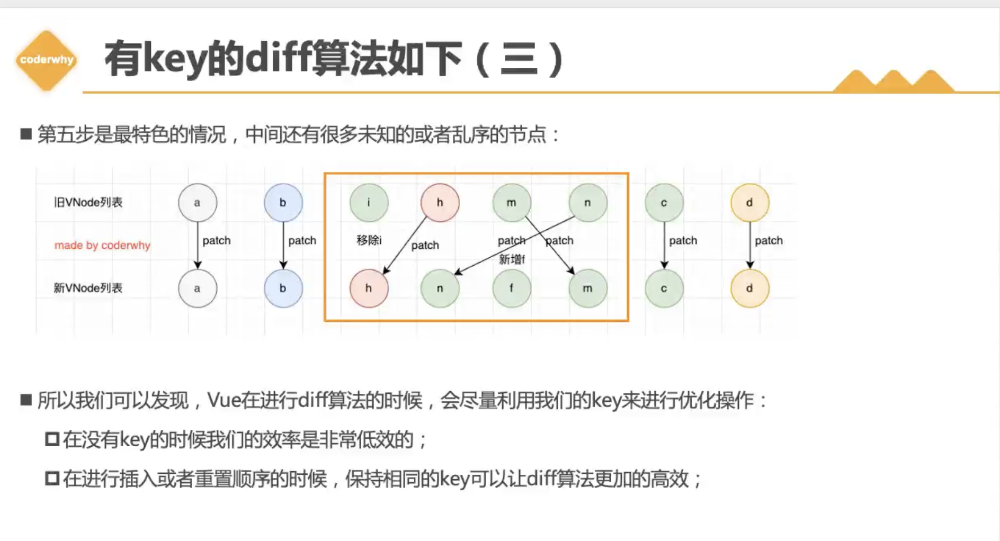

显式优先级高于隐式优先级