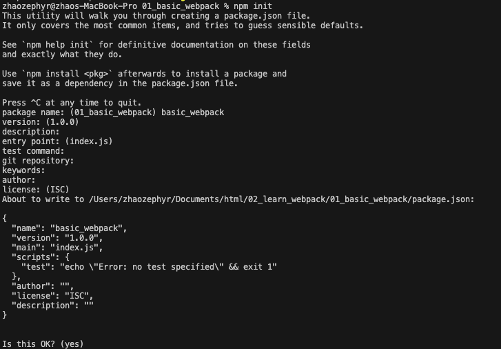
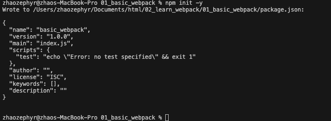

有两种方式
+ 方式1
npm init 然后一直回车  


+ 方式2
npm init -y 这个方法不用回车


会生成一个记录着包信息的package.json文件，有了这个文件 可以执行npm install webpack webpack-cli -D/--save-dev 进行局部安装，代表开发依赖 不加代表生产依赖，执行完成后会多一个package-lock.json文件，记录了我们安装的版本号，下一次也可以找这个版本
node_modules目录，里面放的是包的依赖
要使用局部的webpack 需要配置package.json文件

```json
"scripts": {
    "build": "webpack"
  },
```
之后可以执行npm run build打包，build和上面script里面的build是对应的，如果写的是别的 那就是用别的npm run xxx

执行npm run build 就可以打包了
或者去node_modules里面去找node_modules/.bin/webpack 执行这个webpack打包
还有npx webpack命令 也可以直接用本地的
执行上面的npx webpack和npm run build是一样的，都会默认去当前目录下找./src/index.js文件
如果想要指定别的入口 可以指定 npx webpack --entry ./src/main.js --output-path ./build
如果想用npm run build的格式，需要在webpack.config.js里面配置

```javascript
// webpack.config.js
const path = require("path");

module.exports = {
    entry: "./src/main.js",
    output: {
        // 这里需要用绝对路径
        path: path.resolve(__dirname, "./dist"),
        // 指定打包生成的文件名
        filename: "bundle.js"
    }
}
```
"build": "webpack --config webpack.config.js"
用来指定配置文件
